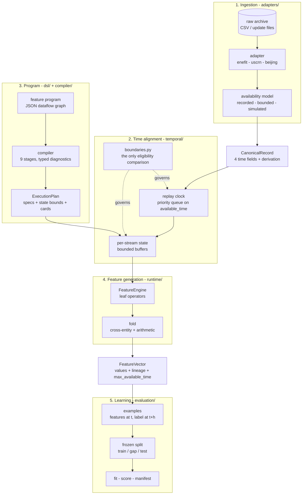
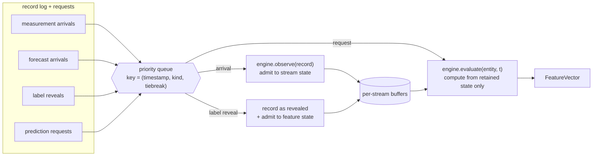
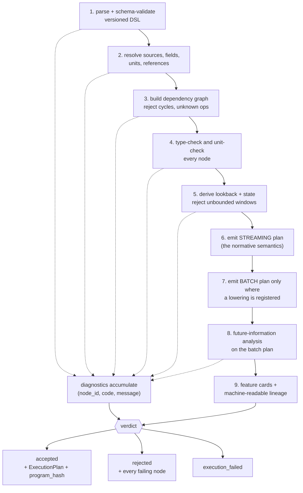
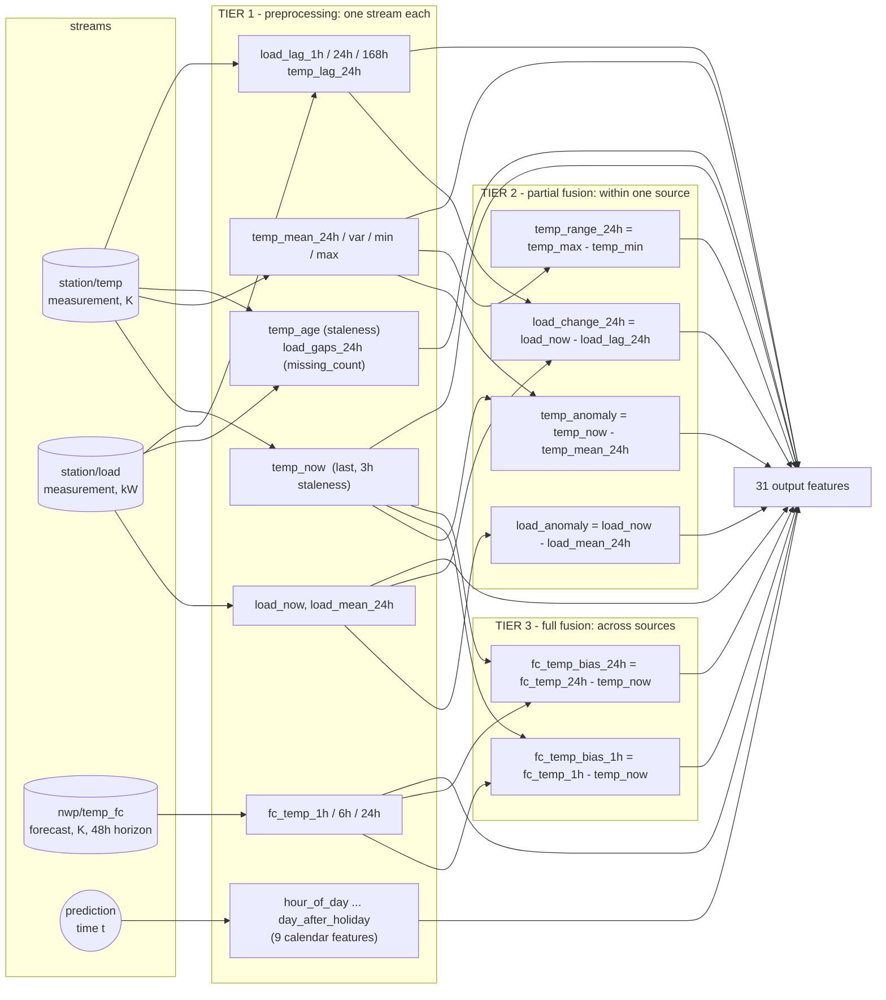

# Streaming Data Fusion in `vifusion`

**How heterogeneous IoT streams become a verified feature vector**

*A technical whitepaper for the `verified-iot-fusion` artifact.*
Revision 2026-09-16 · 16 figures · plan of record: [docs/research_plan.md](research_plan.md)

---

## 0. Summary

`vifusion` fuses several unsynchronised, unreliable, differently-clocked data streams into one
feature vector per *(entity, prediction time)* — and it does so under a single discipline:

> **A feature may only be computed from records that had actually arrived by the moment the
> prediction was requested.**

Almost every design decision in this system follows from taking that sentence literally. The
system separates *when something happened* from *when we found out about it*, enforces the
distinction in one place, and then arranges the rest of the architecture so that no component
is even capable of violating it. Where a conventional pipeline aligns streams by resampling
onto a shared time index — quietly borrowing values from the future — this one aligns them by
**replaying their arrival order through a clock**.

The result is a fusion pipeline where:

* every input record carries four distinct timestamps and a documented derivation of the one
  that governs eligibility;
* every computed feature carries the set of record identifiers that produced it, and the
  latest availability among them;
* the semantics are defined by the *streaming* path, and the faster batch path must earn
  admission node by node by proving equivalence;
* the memory a program will consume is derived at compile time and checked against what the
  runtime actually retains.

This document walks the whole path — stream to record to alignment to feature to training
example — with a figure at each stage.

---

## 1. The problem this pipeline exists to solve

Consider an ordinary fusion task: predict a prosumer's energy consumption 24 hours ahead,
using its own load history, a weather station's observations, a numerical weather forecast,
and a day-ahead electricity price.

Those four streams disagree about time in four different ways.

| Stream | Cadence | Delay to availability | Revisable? | Describes |
|---|---|---|---|---|
| Load (measurement) | hourly | minutes to hours; backfills happen | no | the past |
| Station weather (measurement) | hourly, per grid point | delivered in batches | no | the past |
| NWP (forecast) | a few issues per day | issue-to-publication lag | **yes** — later issues supersede | the **future** |
| Day-ahead price (forecast) | daily | published the day before | yes | the **future** |

A naive pipeline joins these on a timestamp column. That single decision introduces at least
three defects, all of which produce a *plausible* table:

1. **The timestamp is ambiguous.** For a forecast, is it the issue time or the valid time?
   Joining on the wrong one makes tomorrow's weather available today.
2. **A backfilled observation is treated as though it was always there.** A station that
   relays its 02:00 reading at 05:00 will, in a batch join, appear to have been available at
   02:00 — and any model trained on that table has been shown information it would never have
   had online.
3. **The label's own delay is ignored.** A target revealed two days after the hour it
   describes can still land in a training fold whose features stop yesterday.

None of these is visible in the resulting feature table. Every value looks reasonable. The
model's offline score is simply, silently, too good.

`vifusion` prevents all three structurally rather than by review.

---

### Figure 1 — The whole pipeline



The five stages correspond to five directories under [src/vifusion/](../src/vifusion/). The
correctness claim is carried by the boundary between ② and ④: the engine can only see what
the clock has released to it.

---

## 2. The canonical record: four clocks, never conflated

Everything an adapter produces is a
[`CanonicalRecord`](../src/vifusion/temporal/records.py). It is one scalar observation, not a
row — a wide CSV row becomes many records, one per column, because a stream is keyed by
`(entity_id, source_id, feature_name)` and different columns are different streams.

Its central property is that it carries **four separate time fields that the implementation
is never allowed to substitute for one another**.

### Figure 2 — The four clocks

```
 MEASUREMENT / LABEL

   event_time ────────── delay ────────── available_time
       ●                                        ●
   when it happened                    when we could first use it
   (what the value describes)          (what governs eligibility)


 FORECAST

   issued_time ──── lag ──── available_time  ...........▶  valid_time
        ●                          ●                            ●
   when the run                when it was            the future instant
   was produced                published             the value describes

   enforced: available_time >= issued_time
   note:     valid_time may be arbitrarily far ahead — that is not a leak.
             The leak would be reading an issue that had not been published yet.


 LABEL — the same two fields under a second vocabulary

   event_time       IS  label_time
   available_time   IS  label_available_time

   Exposed as read-only aliases rather than duplicated fields: a label is a record
   like any other, and duplicating them would create exactly the chance for the two
   to diverge that the canonical form exists to remove.
```

Three kind-specific invariants are **enforced in the constructor**, not documented, because
each describes a physically impossible record:

| Invariant | The impossible record it refuses |
|---|---|
| `available_time >= event_time` for measurements and labels | a reading available before it was taken |
| `available_time >= issued_time` for forecasts | a forecast published before it was run |
| non-forecasts carry no `valid_time` / `issued_time` | a measurement claiming a forecast's semantics |
| every timestamp is timezone-aware | a naive timestamp, which adopts the parsing machine's zone |

That last one is not pedantry. Beijing's `year/month/day/hour` columns and Enefit's naive
timestamps would otherwise mean different things on a laptop in Ljubljana and a CI runner in
UTC; each adapter declares the dataset's zone as a constant (`Asia/Shanghai`,
`Europe/Tallinn`) and applies it on read.

**Deduplication.** Brokers redeliver. [`deduplicate()`](../src/vifusion/temporal/records.py)
collapses repeat deliveries of one `record_id`, keeping the **earliest** arrival — a retry
cannot make information less available than it already was, and taking the earliest is the
only choice independent of how the log was assembled. Two deliveries sharing an identifier
but disagreeing on content **raise** rather than resolve: the identity assumption is already
broken, and silently keeping one would pick a value on the source's behalf. This matters more
than it looks — a redelivered reading counted twice moves every aggregate over it *while
leaving the lineage looking correct*, because lineage is a set of identifiers and the
identifier appears once either way.

---

## 3. Ingestion: where availability comes from

The rule is blunt: *if a dataset has no recorded availability, the adapter must label the
availability model as simulated and store its parameters.* In
[adapters/base.py](../src/vifusion/adapters/base.py) this stops being a docstring and becomes
an invariant — `normalise()` is the **only** supported path from raw data to a record, and it
accepts no `available_time` argument at all. It accepts an `AvailabilityModel`, and derives
one.

The substitution the plan forbids is therefore *not available to write*.

### Figure 3 — The three availability models in use

```
┌────────────┬──────────────────────────────────────────────┬───────────────────────┐
│ recorded   │ the source states when records shipped       │ ENEFIT                │
│            │                                              │                       │
│            │ available_time := the stated delivery instant│ data_block_id groups  │
│            │                                              │ rows delivered        │
│            │ ! the file records WHICH rows shipped        │ together; the mapping │
│            │   together, not WHEN. The wall-clock release │ block -> instant is   │
│            │   is a DECLARED parameter (BlockSchedule),   │ an experiment input,  │
│            │   with no default — stated by whoever runs   │ stored per record and │
│            │   the experiment, not assumed by the adapter │ in the manifest       │
├────────────┼──────────────────────────────────────────────┼───────────────────────┤
│ bounded    │ availability known only as an upper bound    │ USCRN                 │
│            │                                              │                       │
│            │ available_time := close of the dissemination │ hourly update files   │
│            │                   window the record arrived  │ whose names describe  │
│            │                   in                         │ the window they       │
│            │                                              │ disseminated          │
│            │ The record became usable at SOME instant     │                       │
│            │ inside the window; the close is the only one │ "observations may be  │
│            │ the archive evidences.                       │  relayed several      │
│            │ => the error is always in the safe direction:│  hours late"          │
│            │    eligible no earlier than it truly was.    │                       │
│            │    It can lose realism; it cannot            │                       │
│            │    manufacture a leak.                       │                       │
├────────────┼──────────────────────────────────────────────┼───────────────────────┤
│ simulated  │ the dataset records nothing; we declare      │ BEIJING, USCRN finals │
│            │                                              │                       │
│            │ available_time := event_time + declared delay│ named arrival         │
│            │                                              │ scenarios ('typical', │
│            │ The delay is an EXPERIMENTAL PARAMETER,      │ 'prompt', 'staggered')│
│            │ stored in every record and in the manifest.  │ so that sensitivity   │
│            │ A result under one scenario can never be     │ to the assumption is  │
│            │ mistaken for one under another.              │ measurable, not       │
│            │                                              │ hand-waved            │
├────────────┼──────────────────────────────────────────────┼───────────────────────┤
│ inferred   │ NOT IMPLEMENTED — raises NotImplementedError │ (no consumer)         │
│            │ No committed dataset needs it. An            │                       │
│            │ availability model that quietly guesses is   │                       │
│            │ the exact failure this module prevents.      │                       │
└────────────┴──────────────────────────────────────────────┴───────────────────────┘
```

Every normalised record embeds its own `AvailabilityDerivation` in `provenance`, so the
question *why was this eligible then?* is answerable per record, months later, from the
artifact alone.

### Figure 4 — What a record carries out of the adapter

```
CanonicalRecord
├── record_id        "enefit:train.csv:8:2021-09-01T03:00+03:00:7:consumption"
├── kind             label
├── entity_id        "7"                          ← prediction unit
├── source_id        "enefit_target"              ← excluded from searchable sources
├── feature_name     "target_consumption"
├── value            41.36
├── unit             "kilowatt_hour"
├── event_time       2021-09-01T03:00:00+03:00
├── available_time   2021-09-03T11:00:00+03:00    ← DERIVED, never copied
└── provenance
    └── availability
        ├── model       "recorded"
        ├── rule        "released with data_block_id 10, 2 blocks after the data_block_id 8
        │                this row is filed under, because the competition reveals a block's
        │                targets that many blocks later rather than with the request they
        │                answer"
        ├── evidence    "data_block_id 8 -> released as block 10"
        └── parameters  {first_block_id: 0,
                         first_release: "2021-08-31T11:00:00+03:00",
                         interval_seconds: 86400.0}
```

That Enefit target case is worth dwelling on, because it is the archetype of the whole
problem. `train.csv` files each target row under the `data_block_id` of the block that
*asked* for that day's prediction — not the block that *revealed the answer*. Dating labels
by their own block publishes tomorrow's answer today. It is not a subtle leak; it is an
impossible record, and the canonical constructor refuses it outright. The correction
(`LABEL_REVELATION_LAG_BLOCKS = 2`) is read off the competition's own example files rather
than assumed.

**Two structural separations happen at ingestion, not later:**

* **Targets are `label` records in their own source**, and
  `DatasetBundle.searchable_sources()` excludes them. A feature-search interface offered the
  target as an input would produce a leak *no temporal analysis could catch* — nothing about
  it is temporally wrong. On Beijing this separation is the only thing keeping them apart:
  the label literally is a later PM2.5 observation of the same sensor.
* **Weather is many entities, not one collapsed stream.** The Enefit weather files carry many
  grid points per timestamp. Rather than pick or average one in pre-processing — discarding
  data the *modelling* side should be choosing among — each grid point becomes its own entity
  `station:{lat}:{lon}` carrying its full series, and a declared **entity graph**
  (`weather_stations`) records which stations sit in which county. This follows Kenda et al.
  2019's per-source adapters with declared stream wiring, and it is what the cross-entity
  operators of §6.4 read through.

The adapter's output is a `DatasetBundle`: records, the `SourceSchema` declarations a program
can compile against, the target source ids, checksums of every raw file, and the resolved
entity graphs. [`validate()`](../src/vifusion/adapters/base.py) then measures it against six
checks — timezone-awareness, conflicting identifiers, join cardinality, availability
coverage, and so on — and the result becomes the dataset card under
[artifacts/cards/](../artifacts/cards/).

---

## 4. Time alignment

This is the heart of the system, and it is two ideas: **one place decides inclusivity**, and
**one loop decides visibility**.

### 4.1 The boundary module — inclusivity decided exactly once

Ties are where temporal defects live. A record whose `available_time` is *exactly* the
prediction time: visible or not? An event landing exactly on a window edge: in or out?

[temporal/boundaries.py](../src/vifusion/temporal/boundaries.py) answers those questions once
and is the **only** module in `src/` permitted to compare an availability against a prediction
time. A test — [tests/leakage/test_boundary_is_defined_once.py](../tests/leakage/test_boundary_is_defined_once.py)
— fails the build if any other module restates the comparison.

### Figure 5 — The four boundary rules

```
                              prediction_time t
                                      │
  ── AVAILABILITY ────────────────────┼──────────────────────────────────
                                      │
        available_time <= t  VISIBLE  ●  available_time > t  WITHHELD
                                   inclusive
                                      │
  ── TRAILING WINDOW  (t - w, t] ─────┼──────────────────────────────────
                                      │
        ○─────────────────────────────●
     t - w                            t
     EXCLUSIVE                     INCLUSIVE
     left edge open so that consecutive windows TILE time without overlap.
     With both edges closed, a record on a boundary would be counted in two
     adjacent windows, and an "hourly mean" sampled hourly would intermittently
     average two observations instead of one.
                                      │
  ── STALENESS ───────────────────────┼──────────────────────────────────
                                      │
        t - event_time <= max_staleness   → still fresh  (age equal to the
                                             bound is WITHIN it)
                                      │
  ── LABEL USABILITY ─────────────────┼──────────────────────────────────
                                      │
        label_available_time <= t  →  usable for learning or scoring at t
                                   inclusive
```

The asymmetry is deliberate and is recorded in the decision log: **availability is inclusive,
the window's left edge is not**. Eligibility asks *had it arrived?*; the window asks *which
slice of event-time does this aggregate cover?* Conflating the two — filtering an event-time
window by an availability predicate, or vice versa — is one of the standard ways a leaking
feature gets written.

### 4.2 The replay clock — visibility decided exactly once

Alignment is not resampling. There is no shared time index, no forward-fill, no `merge_asof`.
Instead, [temporal/replay.py](../src/vifusion/temporal/replay.py) pushes three kinds of event
into **one priority queue ordered on time of visibility** — `available_time` for records,
`prediction_time` for requests — and drains it.

The operators read only from buffers this loop has already released. An operator *cannot*
address a record the clock has not delivered, because it has no way to reach one. Eligibility
is therefore enforced once, by the loop, and never re-checked per operator.

### Figure 6 — The three-event replay queue



**The tie policy at equal timestamps is the inclusive boundary expressed as an execution
order:**

```
  at the same instant t:

    0  RECORD_ARRIVAL      ─┐  a record available at exactly t has entered state
                            │  by the time the request at t is served
    1  LABEL_REVEAL        ─┤  a label revealed at t may inform learning before
                            │  the request at t is served
    2  PREDICTION_REQUEST  ─┘  reads state that is, by then, complete

  The final tiebreak component is DATA-DERIVED — a record id, or the request's
  index — never the position a record occupied in the input. Ordering on ingestion
  position would make replay depend on how the log was assembled.
```

`EventKind` is an `IntEnum` whose *values are the policy*. The boundary module and the queue
must agree, and the enum is ordered so that they do.

Label records are pushed once and serve twice: they are released as reveals **and** admitted
to feature state. Their two gates coincide by construction — for a label,
`available_time` *is* `label_available_time` — so an autoregressive feature over past targets
is subject to precisely the same reveal delay that learning is.

**Lateness cannot occur within one replay.** Because the queue is ordered by availability, a
record is always processed before any request that could see it. Out-of-order *arrival* is
therefore ordinary: an observation whose event time is older than one already admitted simply
joins the window when it lands. What cannot happen inside a replay is a record arriving after
a vector that should have contained it was already emitted. That is a property of *re-reading
an archive*, and it is handled separately in §8.

### 4.3 A worked alignment

The repository ships a demonstration: [configs/programs/synthetic_demo.yaml](../configs/programs/synthetic_demo.yaml)
over [tests/fixtures/demo_records.yaml](../tests/fixtures/demo_records.yaml), run as
`vifusion explain`. The fixture is built as a trap — it contains a delayed measurement carrying
the value `999.0` and a forecast issued after the prediction time.

### Figure 7 — One prediction time, seven records

```
  request at t = 03:00Z, entity e1

  stream: station/temp (measurement)

    id        event       available     value    at t=03:00
    ───────────────────────────────────────────────────────────────────
    m1        00:00       00:00         270.0    ✔ eligible
    m2        01:00       01:00         271.5    ✔ eligible
    m3_late   02:00       05:00         999.0    ✘ WITHHELD  ◀ backfill
    m4        03:00       03:00         272.0    ✔ eligible  ◀ boundary,
                                                                inclusive

  stream: nwp/temp_fc (forecast, all three for valid_time 06:00)

    id        issued      available     value    at t=03:00
    ───────────────────────────────────────────────────────────────────
    f_old     00:00       00:00         274.0    ✔ eligible, superseded
    f_new     02:00       02:30         275.0    ✔ eligible, SELECTED
    f_future  04:00       04:00         280.0    ✘ WITHHELD  ◀ not yet
                                                                issued

  timeline
  00:00      01:00      02:00   02:30   03:00      04:00      05:00
    │          │          │       │       │          │          │
   m1         m2      (m3 obs)  f_new   m4 ●        f_future  m3_late
   f_old                                  │          arrives   arrives
                                          │
                                     ─────┴─── request served here
                                     everything to the right is invisible
```

And the actual output:

```
$ uv run vifusion explain configs/programs/synthetic_demo.yaml \
      --records tests/fixtures/demo_records.yaml

prediction_time 2024-01-01T03:00:00+00:00  entity e1
  eligibility
    visible   f_old      available 2024-01-01T00:00:00+00:00
    visible   m1         available 2024-01-01T00:00:00+00:00
    visible   m2         available 2024-01-01T01:00:00+00:00
    visible   f_new      available 2024-01-01T02:30:00+00:00
    visible   m4         available 2024-01-01T03:00:00+00:00
    WITHHELD  f_future   available 2024-01-01T04:00:00+00:00
    WITHHELD  m3_late    available 2024-01-01T05:00:00+00:00
  features
    temp_now                272.0   from [m4]
    temp_mean_6h     271.1666666666667   from [m1, m2, m4]
    temp_sd_6h       1.0408329997330608   from [m1, m2, m4]
    temp_age                  0.0   from [m4]
    temp_gaps_6h              3.0   from [m1, m2, m4]
    temp_fc_3h              275.0   from [f_new]
    fc_minus_now              3.0   from [f_new, m4]
    temp_anomaly     0.8333333333333144   from [m1, m2, m4]
```

Read the lineage column. The value `999.0` appears nowhere — not in `temp_now`, not in the
mean, not in the standard deviation. `temp_gaps_6h = 3` is the system *reporting* the gap that
`m3_late`'s absence created (six expected in a 6-hour window at an hourly cadence, three
observed) rather than papering over it. `temp_fc_3h` selected `f_new` over `f_old` — latest
*eligible* issue — and `f_future` was never a candidate.

This is the shape of every alignment decision in the system: nothing is interpolated, nothing
is forward-filled across an availability boundary, and what is missing is *measured* rather
than imputed.

---

## 5. The feature program: a compiled dataflow graph

Features are not code. They are a **versioned JSON/YAML dataflow graph** — a list of
`{id, op, inputs, params}` nodes — parsed by [dsl/schema.py](../src/vifusion/dsl/schema.py)
and checked by [compiler/compile.py](../src/vifusion/compiler/compile.py).

The representation was chosen, not inherited. A graph rather than an infix expression
language means validation is Pydantic plus a topological sort rather than a hand-written
parser; every diagnostic is addressable as `(node_id, code, message)`; and — because an LLM
proposes these programs in this project — schema-constrained decoding makes well-formed model
output cheap, while no generated string ever reaches an interpreter.

Durations are text (`"24h"`, `"30m"`), not seconds, for a specific reason: a model emitting
`3600` where an hour was meant produces a plausible wrong program; `"1h"` does not.

### 5.1 The operator registry

[dsl/registry.py](../src/vifusion/dsl/registry.py) declares every operator's input types,
output type, unit rule, time direction, null policy, state behaviour, batch lowering and
parity budget. It is kept small — the tension between *a DSL too weak to express useful
features* and *a DSL too permissive for verification to stay reliable* is resolved by admitting
operators only from documented failure analysis, and every addition enlarges the surface the
correctness claim has to cover.

What the registry is *not* is an experimental parameter. A search draws from the operator set
its task declares, not from whatever the registry happens to contain, so registering an
operator changes what the software can express and changes no recorded result. The two were the
same variable until 2026-09-15, which had the effect of making every library improvement a
protocol decision — and had left operators the plan of record specifies unimplemented.

| Family | Operators | Reads | State |
|---|---|---|---|
| Point reads | `last` (± `max_staleness`), `lag`, `staleness` | newest / exact event-time match | 1 record, or the lag window |
| Window aggregates | `count` `sum` `mean` `variance` `stddev` `min` `max` `median` `p25` `p75` `iqr` `mad` | trailing `(t-w, t]` | retained raw window |
| Window trend and timing | `slope` `time_since_max` `time_since_min` | trailing window, reading event times as well as values | retained raw window |
| Data quality | `missing_count` | trailing window vs declared cadence | retained raw window |
| Forecast | `forecast` (lead + revision policy) | eligible issues for `t + lead` | one entry per reachable valid time |
| Calendar | `hour_of_day` … `day_after_holiday` | **nothing** — pure function of `t` | none |
| Cross-entity | `cross_entity_mean` | latest value on each related entity | one record per related entity |
| Categorical | `mode` `distinct_count` over a window; `equals` `is_in` over a node | a category | retained raw window; none for the predicates |
| Arithmetic | `add` `subtract` `multiply` `divide` `coalesce` | other nodes | none |

#### The seventeen window aggregates

Every one of these reduces the same thing — the raw records retained for the trailing window
`(t - w, t]` — and every one is exact over that window. They differ only in what they reduce it
to, and in whether they read event times as well as values.

| Aggregate | Returns | Output unit | Parity |
|---|---|---|---|
| `count` | observations present | dimensionless | exact |
| `sum` | total | preserved | 4 ulp |
| `mean` | arithmetic mean | preserved | 4 ulp |
| `variance` | **sample** variance, `n-1`, null below two observations | unit² | 16 ulp |
| `stddev` | square root of the above | preserved | 16 ulp |
| `min` / `max` | extremes | preserved | exact |
| `median` | `q = 0.5`, interpolated | preserved | exact |
| `p25` / `p75` | first and third quartiles | preserved | exact |
| `iqr` | `p75 - p25` | preserved | exact |
| `mad` | `median(abs(x - median(x)))`, **unscaled** | preserved | exact |
| `slope` | least-squares trend of value on event time | unit **per second** | 32 ulp |
| `time_since_max` / `time_since_min` | seconds back to the extremum | seconds | exact |
| `mode` | most frequent value; ties to the most recent | preserved | exact |
| `distinct_count` | how many distinct values occurred | dimensionless | exact |

The last two are defined on a **category** as well as a number, and they are the only two
that are. Every other aggregate declares a numeric input, and the compiler refuses the
rest with `E-TYPE-002` — a mean of a wind direction is not a weak feature but a meaningless
one. `mode` and `distinct_count` escape that rule by doing no arithmetic: one counts
occurrences and selects, the other counts distinct values. A category is then tested with
`equals` or `is_in`, which take a *node* rather than a stream, so `equals(last(wd), "N")` asks
about the current wind and `equals(mode(wd, 24h), "N")` about the prevailing one. A predicate
answers with a number and **propagates null rather than answering false** — "not northerly"
and "we do not know" are different claims, and a model handed `0.0` for both cannot separate
them.

Four conventions are fixed once and shared by all three implementations, because a convention
two implementations chose differently would make the differential suite measure the convention
instead of the code:

* **Quantiles interpolate linearly** between order statistics at `h = (n-1)q` — NumPy's default
  and R's type 7. The median is `q = 0.5` under the same rule, so at even counts it is the
  midpoint of the two central values rather than the lower of them.
* **`mad` is unscaled.** No `1.4826` factor: the scaled form estimates a normal distribution's
  σ, and applying it here would bury a normality assumption inside an operator that otherwise
  reports a plain unit-preserving spread.
* **`slope` is a rate**, reported per second and given its own unit rule so that a trend cannot
  compile to the units of a level. It is null below two observations, and null when every
  observation in the window shares one event time — a vertical line is not a steep one.
* **`mode` breaks a tie toward the most recent category**, the same rule, so that "the
  prevailing value" means one thing wherever it appears. A mode is a selection: it returns a
  value that actually occurred, never a blend, which is what lets it carry lineage at all.
* **Ties in `time_since_*` go to the most recent occurrence.** "How long since the peak" means
  the latest peak. This is the likeliest place three implementations drift apart, because the
  natural spellings of `max` and `min` break ties in opposite directions.

Note what the parity column says: **the order statistics are exact, and the moments are not.**
That inverts the usual expectation, and the reason is structural. A quantile selects and
interpolates once; `mad` selects, subtracts elementwise, then selects again. Neither contains a
sum, so there is no summation order for two implementations to disagree about. `mean` and
`variance` do contain one, and a one-pass Welford update genuinely disagrees in the last bits
with a two-pass `math.fsum`. `slope` carries the widest budget in the system for the same
reason, sized by measurement rather than guessed.

The order statistics also cost **no state that the moments do not already cost**. The usual
objection to a streaming median — that it needs unbounded memory or an approximate sketch —
does not apply, because the decision to exclude sketches already requires the whole window to
be materialised before it is reduced. A median is therefore the same memory as a mean. The set
that existed before 2026-09-15 was the set expressible as a *constant-space accumulator*, which
was never a constraint this system was under.

Three constraints are structural rather than remembered:

* **No approximate sketches.** Every aggregate is exact over a retained window, so
  batch/stream parity is testable as an equality rather than as a statistical claim. The
  memory cost is accepted and bounded.
* **State bounds come from lookback *and* declared arrival rate**, never lookback alone.
* **Parity tolerance is per operator and declared up front**, so it cannot be widened later
  under schedule pressure.

Three entries deserve notes. `lag` is **exact by event time** — no nearest-neighbour fallback,
because an approximate match would make the operator's semantics depend on the sampling grid.
And `coalesce` was added from measured failure: on Beijing, the 24-hour lag is null at every
one of the twelve stations (1.3%–6.3% of validation prediction times), so a seasonal-naive
floor was literally unwritable and the task fell back to a materially weaker persistence
baseline. `coalesce` is *selection*, not imputation — it reports the lineage of whichever
input answered, so a reader can still see which expression produced the number. The quantiles,
`slope`, `mad` and the two `time_since` operators arrived on 2026-09-15 from a different kind
of failure — a failure to implement the plan. Exact quantiles and a trailing slope are named in
the plan of record as operators the first implementation should support, and had simply been
left out; `mad` and the `time_since` pair came with them as the reductions unreachable by
composing what already existed, being a spread around the median and *when* within a window an
extremum fell, which `min` and `max` discard.

### 5.2 The nine compiler stages

### Figure 8 — Compilation



Two properties matter more than the stage list.

**Streaming is the normative semantics.** The batch path is an optimisation that must earn
admission node by node. Temporal leakage originates almost entirely in batch code, where a
grouped aggregation can silently span the future — so the path that cannot express that
mistake is the one the semantics are defined against.

**The verdict is accepted, rejected, or execution_failed — never silently repaired.** A
compiler that quietly fixed a candidate would destroy the measurement the project exists to
make. Diagnostics *accumulate* rather than stopping at the first problem, because a repair
loop that learns one error per round is conversational rather than mechanical.

Diagnostic codes are a frozen protocol, grouped into families so that a rejection breakdown
answers a question someone would actually ask:

| Family | Meaning | Example codes |
|---|---|---|
| `E-SCHEMA` | not a well-formed program | `E-SCHEMA-001/002` |
| `E-RESOLVE` | a name does not resolve | unknown operator, source, field, timezone, entity graph |
| `E-GRAPH` | malformed dataflow | cycle, duplicate id, wrong arity, missing/unknown param |
| `E-TYPE` | wrong value type | `AGGREGATE_OVER_CATEGORY` |
| `E-UNIT` | dimensional analysis fails | `UNIT_INCOMPATIBLE`, `UNIT_UNKNOWN` |
| **`E-TIME`** | **the program could read information it would not have had** | `WINDOW_NOT_POSITIVE`, `LAG_NOT_POSITIVE`, `FUTURE_SOURCE_MISUSED`, `BATCH_LOWERING_READS_FUTURE` |
| `E-RESOURCE` | state cannot be bounded, or exceeds budget | `STATE_UNBOUNDABLE`, `STATE_BUDGET_EXCEEDED` |

`E-TIME` is the family the correctness claim is about. The others largely measure how well a
proposer writes conforming output, which is a different question and is not pooled with it.

**Units are real.** Dimensional analysis runs on Pint, with currency defined as its own base
dimension — euros per megawatt-hour is a genuine unit, and flattening it to dimensionless
would let a price be added to a temperature. Two currencies are *not* interconvertible without
a rate this system does not have, so a second currency would require a second dimension
rather than a conversion factor: adding euros to dollars must fail rather than silently pick
one.

---

## 6. Feature generation

### 6.1 The three tiers of fusion

The expert baseline program [configs/programs/m2_expert_baseline.yaml](../configs/programs/m2_expert_baseline.yaml)
expresses Kenda et al. 2019's feature vocabulary in the DSL. The original system's three
conceptual stages appear here as three *tiers of nodes* in one graph rather than as three
components:

### Figure 9 — M2, the expert baseline, as a dataflow graph



Tier 3 is where fusion actually pays: `fc_temp_bias_*` is the forecast's *disagreement* with
the latest observation — a quantity that exists only because two heterogeneous streams were
aligned on a common eligibility rule. It is not available from either stream alone.

Two corrections to the original system are visible in the program text. The timezone is a
**required parameter** on every calendar node (the original read JavaScript `Date` in the host
process's local zone, with daylight-saving behaviour that was never specified or tested — so
a feature's value depended on which machine computed it). And holidays are **declared in the
program**, so they hash into the program identity: changing which days count as holidays
changes the identity of every run that used them, instead of silently altering a feature.

### 6.2 Execution: two layers

[runtime/streaming.py](../src/vifusion/runtime/streaming.py) runs a compiled plan in two
layers, and the split is what keeps the leak surface small:

```
  LAYER 1   leaf nodes lower to temporal specs and run through the REPLAY CLOCK
            → eligibility enforced once, by the loop

  LAYER 2   arithmetic and cross-entity nodes FOLD over the resulting values in
            topological order
            → they read no records at all, so they cannot introduce a leak the
              clock did not already permit
```

Null handling in layer 2 follows the `propagate` policy: a combination of an unknown value is
unknown, not zero. Division by zero yields null for the same reason — the ratio is undefined,
and returning an infinity would place a value in the feature table that no model can read as
missing.

### 6.3 Engine state: what is retained, and why

[temporal/engine.py](../src/vifusion/temporal/engine.py) maintains bounded per-stream buffers.
Raw windows are retained, not summarised.

### Figure 10 — Per-stream retained state

```
  FeatureEngine
  │
  ├── _streams : {(entity, source, feature) → StreamState}
  │   │
  │   │   StreamState
  │   │   ├── bounded_lookback   longest reach of specs that READ THE WINDOW
  │   │   ├── state_bound        the compiler's per-stream figure
  │   │   ├── window   [ ●  ●  ●  ●  ●  ● ]   raw records inside the reach
  │   │   │             └── pruned at EVALUATION, not arrival, because the
  │   │   │                 window is defined relative to the prediction time
  │   │   │                 and an arrival's delay is arbitrary
  │   │   │
  │   │   └── last_known   [ ● ]   newest record CARRYING A VALUE, retained
  │   │                            even once it falls out of the window —
  │   │                            an unbounded `last` or `staleness` needs it,
  │   │                            and one record is cheaper than one unbounded
  │   │                            window
  │   │
  ├── _forecasts : {(entity, source, feature) → ForecastState}
  │   └── entries : {valid_time → best eligible issue}
  │       running maximum: eligibility is MONOTONE — once released, always
  │       released — so the best issue seen so far is the best available.
  │       Pruned at t + min_lead: requests only move forward, so an earlier
  │       valid time can never be asked for again.
  │
  └── _admitted : {record_id → content_signature}
      the idempotence memory. Grows with DISTINCT RECORDS, not with the
      retained window, so it sits OUTSIDE the compiler's state bound and is
      declared as such. Bounding it would make replay depend on how long ago
      a duplicate arrived — which would not be replay.
```

Two retention subtleties, both found by testing rather than by reasoning:

* **Eviction is conservative — the horizon is closed, not half-open.** Trailing windows
  exclude their left edge, but an exact lag of `L` addresses precisely the instant `t - L`, so
  evicting on `>` would discard the one record that operator needs. Retention is a memory
  optimisation; filtering is the evaluator's job. A retention rule tighter than an operator's
  reach silently returns null instead of a value — which no test on the *value* would catch.
  The differential suite caught exactly this, which is why the reference oracle prunes nothing
  at all.
* **`reads_window` is a separate question from `lookback`.** `last` under a 24-hour staleness
  bound *has* a lookback — the bound — but it never looks past the newest observation. Sizing
  the buffer from its bound would retain a day of records to answer a question about one, and
  would exceed the bound the compiler declared (which correctly counts that operator as one
  record). The two disagreed until an automated search wrote a program pairing a 24-hour
  staleness bound with a 3-hour window — a combination no hand-written program had.

**Exceeding the state bound raises.** A bursty source can make a bounded window unbounded, and
silently evicting under pressure produces wrong features that pass every correctness test. The
runtime refuses to continue rather than quietly dropping data.

### 6.4 Cross-entity fusion

A `cross_entity_mean` node reads the latest eligible value from each of a home entity's
*related* entities — the weather stations in a prosumer's county, say. The mechanism avoids
adding any cross-entity awareness to the engine:

```
  compile time   the node's entity_ref resolves against a DECLARED
                 EntityGraphSchema on the program (name + max_related_entities).
                 An unknown ref is E-RESOLVE-008, not a runtime surprise.

  specs_for()    the node expands into one ordinary `last` read per related
                 entity, named   {node_id}__related__{related_entity_id}

  replay         the engine sees only ordinary LastValue specs on other
                 entities' streams. No new dispatch.

  fold           the runtime gathers the shadow reads back by the same naming
                 convention and reduces them.

  ⚠  a graph resolving to MORE entities than declared raises ExecutionError —
     it would silently exceed the bound the compiler checked.
```

A related entity with no eligible value is *excluded* rather than propagated as null — the
same convention a windowed aggregate already uses for its own nulls, applied across entities
instead of across time.

### 6.5 Lineage

Every computed value carries the record identifiers that produced it and the maximum
`available_time` among them.

```
  FeatureValue
  ├── name                "temp_mean_6h"
  ├── value               271.1666666666667
  ├── lineage             ("m1", "m2", "m4")        sorted, a set
  └── max_available_time  2024-01-01T03:00:00Z      the latest contributor
```

One rule is enforced in the constructor: **a null value carries empty lineage.** Lineage names
the records that contributed to the value returned; when no value is returned, nothing
contributed. The rule was chosen for being the simplest one two independent implementations
can agree on — the alternative (listing records that were *read* but did not produce a value)
requires deciding, per operator, whether a record rejected by a declared bound was "read", and
two implementations would drift on that question one operator at a time.

The information this discards — that observations existed but were too few or too stale — is
not lost. It is exactly what `count`, `staleness` and `missing_count` report, which is their
purpose.

`coalesce` is the interesting case: it reports the lineage of the input it *actually took*,
not the union. A feature whose lineage named records that did not produce its value would make
the replay audit a fiction.

---

## 7. Two execution paths, one semantics

### Figure 11 — Streaming vs. batch

```
  STREAMING  (normative)                  BATCH  (optimisation)
  ─────────────────────────────────       ─────────────────────────────────
  priority queue on available_time        sort each stream by availability ONCE
            │                                       │
  bounded per-stream buffers              eligible set = CONTIGUOUS PREFIX
  released by the clock                   found by binary search
            │                                       │
  operators read retained state           bisect_right(availability, t)
  only — cannot reach a record                      │
  the clock has not delivered             the eligibility filter is an INDEX,
            │                             not a predicate
  one-pass Welford for mean/variance      two-pass math.fsum arithmetic
            │                                       │
            └──────────┬────────────────────────────┘
                       │
              must agree, and the
              difference in mechanism
              is what makes agreement
              evidence rather than
              coincidence
```

Sorting by *availability* rather than by event time is the whole point of the batch path.
Records with `available_time <= t` form a contiguous prefix of that ordering; sorting by event
time and slicing on the window is precisely the grouped-aggregation mistake that produces a
plausible table in which the future has leaked.

The two paths diverge on purpose. The engine uses a one-pass Welford update; the batch path
and the reference oracle use two-pass sums. They disagree in the last bits, and that
disagreement is the declared parity budget:

| Operator | Parity | Budget |
|---|---|---|
| `count`, `min`, `max` | exact | 0 ulp — these are selections, not arithmetic |
| `median`, `p25`, `p75`, `iqr`, `mad` | exact | 0 ulp — selection plus at most one interpolation |
| `time_since_max`, `time_since_min` | exact | 0 ulp — a selection and one subtraction |
| `sum`, `mean` | tolerance | 4 ulp |
| `variance`, `stddev` | tolerance | 16 ulp |
| `slope` | tolerance | 32 ulp |
| arithmetic, calendar | exact | shared implementation |

`slope`'s budget was set by measurement, not chosen: across twenty thousand random windows
spanning six decades of value scale, offset and drift, the three implementations never
disagreed by more than the criterion allows. It is worth knowing how to re-measure it. In
*relative* ulps alone the worst case looks like 2641 — but that regime is a series with a large
offset and no real trend, where the centred values cancel, the slope is ~1e-17, and two correct
answers sit thousands of ulps apart while agreeing to 1e-18 in absolute terms. This is why the
parity check pairs its relative budget with an absolute floor, and why a relative-only
comparison is the wrong instrument for an operator whose correct answer is often zero.

**Lineage, eligibility decisions, and accept/reject outcomes are compared exactly.** They are
discrete and admit no tolerance. Declaring the numeric budgets up front is what stops them
from being widened later under schedule pressure.

Stage 8 of the compiler closes the last hole: `BATCH_LOWERINGS` is the set of operators the
batch module *actually implements with an availability filter*, and the compiler checks the
registry against it. An operator declaring a lowering nobody implemented is **refused** rather
than silently downgraded — and `batch.execute()` refuses a partially-eligible plan outright,
because a vector half-produced by a path the compiler did not admit is exactly the quiet
substitution the architecture exists to prevent.

### The third implementation: the reference oracle

[temporal/oracle.py](../src/vifusion/temporal/oracle.py) exists to make agreement *mean*
something. It is **structurally independent, not merely separate**: for each prediction time
it re-filters the entire log by `available_time <= t` and computes in plain Python, retaining
**no state whatsoever** between prediction times. It is quadratic and unusable at scale, which
is fine on the synthetic suite.

Because eligibility there is re-derived from scratch rather than maintained, an eviction bug,
a release-order bug, or a stale accumulator *cannot exist in that file*. Two rules keep the
independence honest: nothing in the oracle may import the engine, its state, or its queue
(the only shared code is the vocabulary and the boundary predicates, shared precisely because
inclusivity must be decided once); and no incremental accumulators are permitted.

### Figure 12 — The verification surface

```
                    named scenario corpus (YAML, 8 families)
                    eligibility · windows · staleness_and_gaps
                    out_of_order · forecasts · cross_source
                    labels_and_statics · degenerate
                               │
             ┌─────────────────┼─────────────────┐
             ▼                 ▼                 ▼
       FeatureEngine        Oracle           declared
       (incremental)      (stateless,        expectations
             │             quadratic)        (values + lineage +
             │                 │              eligible set)
             └────────┬────────┘                 │
                      │                          │
              differential test ◀────────────────┘
              304 engine cases                   both are checked against
              381 oracle cases                   the DATA, not merely
                                                 against each other

       plus:  batch ⟷ streaming parity (property-based, Hypothesis)
              leakage suite: boundary defined once; verifier confusion matrix
              property suites: temporal invariants, unit preservation,
                               forecast and label invariants

              1,270 tests total, offline, no dataset required
```

Writing the corpus as **data rather than code** is deliberate: it can be audited line by line
without reading an implementation, and the declared expectations are what turn "two
implementations agree" into evidence. Two implementations agreeing proves only consistency.

---

## 8. Late data

Within one replay, lateness is impossible by construction. Lateness is therefore modelled as
what it actually is: **a second batch of records arriving after a replay has already produced
its vectors** — what a later read of the same archive contains and the first did not.

### Figure 13 — The three policies

```
  baseline replay  ────────────────────────────────▶  vectors v1 v2 v3 v4
                                                          │
  late records arrive (available_time earlier than         │
  prediction times already served)                         │
                                                          ▼
  ┌──────────┬──────────────────────────────────────────────────────────────┐
  │ IGNORE   │ prior outputs stand unchanged.        ◀── THE EVALUATION     │
  │ default  │                                           PATH               │
  │          │ A system that silently revises what it predicted yesterday   │
  │          │ cannot be evaluated: the prediction being scored is no       │
  │          │ longer the prediction that was made.                         │
  ├──────────┼──────────────────────────────────────────────────────────────┤
  │ REVISE   │ recompute affected vectors; report which ones actually       │
  │          │ CHANGED (not merely which were affected).                    │
  ├──────────┼──────────────────────────────────────────────────────────────┤
  │ RETRACT  │ flag affected vectors as retracted, PRESERVING their values  │
  │          │ for audit. A retraction that erased the original prediction  │
  │          │ would destroy the record of what the system actually         │
  │          │ claimed — which is what an audit needs.                      │
  └──────────┴──────────────────────────────────────────────────────────────┘

  Under EVERY policy, including IGNORE, the outcome reports
  affected_prediction_times.

  That is the point: choosing to leave prior outputs untouched is a decision
  about what to publish, not a reason to stop knowing which outputs the
  decision applied to.
```

A retracted vector that folded into an unretracted one would publish exactly the values the
retraction withdrew, so the flag is carried through the fold rather than defaulted.

---

## 9. The replay audit

Phase 5's acceptance test is that *a replay audit can explain why each source value was
eligible*. [runtime/replay_audit.py](../src/vifusion/runtime/replay_audit.py) answers both
halves of that, and the second is the one a debugging session actually starts from.

### Figure 14 — Both halves of the explanation

```
  WHY A VALUE WAS USED                    WHY A VALUE WAS WITHHELD
  ────────────────────────────────        ────────────────────────────────────
  from the feature's lineage:             a null feature has NO LINEAGE, so an
                                          audit built only from lineage says
   • record_id                            NOTHING about it.
   • its available_time
   • the comparison against t             So the audit also reports records on
   • the DERIVATION that produced         the feature's own stream that the
     that availability                    clock had NOT released — newest
                                          first, bounded to the nearest misses,
  The derivation matters: a record        with the same derivation attached.
  eligible under a WRONG availability
  is still reported as eligible by        This turns "why is this null?" from
  any check that trusts the field.        an investigation into a line of
                                          output.

  eligible: available_time 2024-01-01T03:00:00+00:00 <= prediction_time
            2024-01-01T03:00:00+00:00 (boundary inclusive);
            availability recorded: released with data_block_id 10 ...

  withheld: available_time 2024-01-01T05:00:00+00:00 > prediction_time
            2024-01-01T03:00:00+00:00 (boundary inclusive);
            availability simulated: pollutant delay declared by the 'typical'
            scenario ...
```

Alongside the audit, the compiler emits a **feature card** per output — the five things a
reader needs to judge whether a feature is defensible without reading the engine:

```
temp_mean_24h  (mean)
  Mean over the window.
  sources        station/temp
  window         1d
  unit           kelvin (number)
  availability   record.available_time <= prediction_time
  state bound    25 record(s)
  execution      batch or streaming
  parity budget  4 ulp
```

---

## 10. From features to a scored model

Feature-level correctness is necessary and not sufficient. Two leaks live past the feature
vector, and neither is visible to any temporal check that examines features — because in both
cases every feature is perfectly eligible.

### Figure 15 — The two clocks of a training example

```
                         t                    t + horizon         reveal
                         │                          │                │
  features computed ─────●                          │                │
  (eligible at t)        │                          │                │
                         │      target occurs ──────●                │
                         │                          │                │
                         │      target becomes known ───────────────►●
                         │                                     label_available_time
                         │
     ┌───────────────────┴──────────────────────────────────────────────────┐
     │ LEAK 1 — fitting on an example whose label had not yet been revealed │
     │                                                                      │
     │ Every feature in it is eligible. The vector is correct. The model    │
     │ still saw the future.                                                │
     │                                                                      │
     │ revealed_by(cutoff) is the filter, and the ONLY supported way to     │
     │ select training data.                                                │
     └──────────────────────────────────────────────────────────────────────┘


  TRAIN                    GAP                    VALIDATION / TEST
  ├──────────────────────┤├─────────┤├─────────────────────────────────┤
                          ▲
     ┌────────────────────┴─────────────────────────────────────────────┐
     │ LEAK 2 — no gap between training and evaluation                  │
     │                                                                  │
     │ A label revealed AFTER the training cut can still describe an    │
     │ event BEFORE it. Without a declared gap, a model trained to the  │
     │ boundary is scored on a period whose labels were partly visible  │
     │ during training. The leak lives in the REVEAL DELAY, not in any  │
     │ feature.                                                         │
     └──────────────────────────────────────────────────────────────────┘
```

Three rules are enforced by [evaluation/experiment.py](../src/vifusion/evaluation/experiment.py)
rather than trusted:

1. **Fitting uses only labels revealed by the training cutoff.** An example whose target had
   not yet been revealed is not training data, however old its features are.
2. **Scoring uses the test fold and nothing else touches it.** The frozen split under
   [configs/splits/](../configs/splits/) decides which prediction times belong to which fold;
   the runner never chooses a boundary. A split chosen at the call site is a split that can be
   chosen again after seeing the result.
3. **The naive scale for MASE comes from the training fold.** A scale taken from the period
   being scored makes the metric depend on the answers.

Splits also hold **entities out whole**, which is a different question from holding periods
out: later periods test generalisation forward, held-out entities test transfer sideways. The
two mechanisms compose.

Targets come from the label stream, never from feature streams: the target for a prediction at
`t` is the label record whose event time is exactly `t + horizon`, read from sources that
`searchable_sources()` excludes. A target cannot reach a feature program by construction
rather than by discipline.

Every run writes a manifest recording the code revision, environment lock hash, configuration
hash, dataset and raw-file checksums, split manifest hash, **availability model and its
parameters**, program hash, seeds, hardware, and a checksum of every artifact produced. The
availability parameters are in there for a specific reason: a simulated model whose parameters
are not recorded is indistinguishable in the results from a recorded one — which is precisely
the overstatement the whole ingestion design guards against.

---

## 11. What it costs

Measured on the M2 expert baseline (31 output features across three streams), one entity,
504 records, 100 requests, on a 16-CPU Intel Xeon:

| Quantity | Measured |
|---|---|
| Wall time | 0.072 s |
| Throughput | 6,999 records/s · 1,389 requests/s |
| Latency p50 / p90 / p99 | 0.570 / 1.105 / 2.579 ms |
| Peak retained records | 211 |
| Compiled state bound | 243 |

### Figure 16 — Where the 243-record bound comes from

```
  State is a function of lookback AND declared arrival rate — never lookback
  alone, because a bursty source makes even a one-hour window unbounded. The
  rate is therefore a REQUIRED declaration on the source, and its absence is
  E-RESOURCE-001 rather than an optimistic default.

      windowed operator:  ceil(lookback_hours × max_input_rate_per_hour) + 1
      forecast selector:  ceil(horizon_hours  × max_input_rate_per_hour) + 1
      point read:         1

  M2:

    station/temp    max window-reading reach = 24h  (mean/var/min/max 24h,
                                                     lag 24h)
                    rate 1/h        →  ceil(24 × 1) + 1  =   25
    station/load    max reach = 168h (lag_168h)
                    rate 1/h        →  ceil(168 × 1) + 1 =  169
    nwp/temp_fc     horizon 48h, rate 1/h
                                    →  ceil(48 × 1) + 1  =   49
                                                            ─────
                                          total_state_records  243
                                          max_stream_records   169

  Bounds are summed PER STREAM, not per node: three 24-hour aggregates over one
  source share a single window, and adding their individual reaches would
  triple-count it. An upper bound three times the truth would be a misleading
  number in a paper, not a conservative one.

  The runtime enforces max_stream_records per stream and MEASURES the peak,
  which is what makes the compiled bound falsifiable. It has been falsified
  once already: the Phase 4 benchmark measured 23 retained forecast entries
  against a declared bound of 1, because an earlier compiler assumed a forecast
  selector retained a single record. The runtime keeps one entry per reachable
  VALID TIME, so the bound needs the horizon as well as the rate — which is why
  max_forecast_horizon is now a required declaration on forecast sources.
```

That last paragraph is the argument for measuring rather than asserting, in miniature.

---

## 12. Limits, stated

* **No exponential moving average.** Every feature group of the original system is expressible
  in the DSL except the EMA, which is a stated limitation with an argument behind it — see
  [docs/compatibility.md](compatibility.md). An EMA has unbounded reach, so it does not admit
  the exact-over-a-retained-window treatment every other aggregate gets.
* **No approximate sketches.** A deliberate cost: exactness is what makes parity testable as
  an equality. It is also what makes the order statistics affordable — the window is already
  materialised, so a median costs what a mean costs.
* **A category supports counting and testing, not ordering.** `mode`, `distinct_count`,
  `equals` and `is_in` are the whole of it: there is no ordering on a category, so no
  quantile, no extremum and no trend. That is a property of the data rather than a gap.
* **The `inferred` availability model raises.** No committed dataset needs it, and
  implementing a model nothing routes through is how an unused guess ends up in a result.
* **Simulated availability is an assumption, and is labelled one.** Beijing's delays are
  plausible, not measured. That is what named scenarios and recorded parameters are for.
* **The idempotence memory is unbounded**, and declared as such. A deployment needing a bound
  would deduplicate within a declared horizon and accept a double count beyond it; this
  artifact keeps the exact rule instead, because a replay whose correctness depended on how
  long ago a duplicate arrived would not be replay.
* **The diagnostic taxonomy is proposed, not frozen.** It freezes at Gate C together with the
  prompt and the feedback payload; until then codes may be added, split, or renamed.

---

## 13. The design in one page

| Question | This system's answer | Enforced by |
|---|---|---|
| When did it happen vs. when did we learn it? | four separate fields, never substituted | `CanonicalRecord` constructor |
| Where does availability come from? | a declared model, with parameters stored per record | `normalise()` takes no `available_time` |
| Is a record eligible at `t`? | `available_time <= t`, inclusive | `boundaries.py`, the only such comparison |
| How are streams aligned? | replayed through one priority queue on availability | `replay.py` |
| What happens at a tie? | arrivals, then reveals, then requests | `EventKind` ordering |
| What is a feature? | a node in a compiled, typed, unit-checked dataflow graph | `compiler/compile.py` |
| What does a feature cost? | `ceil(lookback_h × rate_per_h) + 1`, checked against measurement | compiler + `peak_state_records` |
| Which records produced this value? | the lineage set, and the max availability among them | `FeatureValue`, checked exactly |
| Why was this null? | the withheld records on that stream, with derivations | `replay_audit.py` |
| Is the fast path safe? | only where a lowering is registered, implemented, and parity-tested | compiler stage 8 + differential suite |
| Can the model see a label it should not? | no — fitting filters on `label_available_time`, splits declare a gap | `evaluation/` |

The unifying idea is worth stating plainly, because it is the one thing to take away: **the
system does not check for leaks. It is built so that the components which could leak cannot
reach the data they would need.** An operator cannot address a record the clock has not
released. An adapter cannot write an `available_time` it did not derive. A batch node cannot
run on a path the compiler did not admit. A feature program cannot name the target stream. A
trainer cannot fit on an unrevealed label.

Checks catch mistakes. Structure prevents them — and it is what makes the remaining checks
worth running.

---

## Reading the code

| Concern | Start here |
|---|---|
| The record and its four clocks | [temporal/records.py](../src/vifusion/temporal/records.py) |
| Inclusivity, decided once | [temporal/boundaries.py](../src/vifusion/temporal/boundaries.py) |
| The replay clock (~200 lines, deliberately) | [temporal/replay.py](../src/vifusion/temporal/replay.py) |
| Retained state and the leaf operators | [temporal/engine.py](../src/vifusion/temporal/engine.py) |
| The independent reference implementation | [temporal/oracle.py](../src/vifusion/temporal/oracle.py) |
| Availability models | [temporal/availability.py](../src/vifusion/temporal/availability.py) |
| Normalisation and the derivation rule | [adapters/base.py](../src/vifusion/adapters/base.py) |
| Availability handed over / reconstructed / simulated | [enefit.py](../src/vifusion/adapters/enefit.py) · [uscrn.py](../src/vifusion/adapters/uscrn.py) · [beijing.py](../src/vifusion/adapters/beijing.py) |
| The DSL and the operator registry | [dsl/schema.py](../src/vifusion/dsl/schema.py) · [dsl/registry.py](../src/vifusion/dsl/registry.py) |
| The nine compiler stages | [compiler/compile.py](../src/vifusion/compiler/compile.py) |
| Streaming (normative) and batch (optimisation) | [runtime/streaming.py](../src/vifusion/runtime/streaming.py) · [runtime/batch.py](../src/vifusion/runtime/batch.py) |
| Late-arrival policies | [temporal/late_data.py](../src/vifusion/temporal/late_data.py) |
| The audit | [runtime/replay_audit.py](../src/vifusion/runtime/replay_audit.py) |
| Tasks, splits, and the two clocks of learning | [evaluation/tasks.py](../src/vifusion/evaluation/tasks.py) · [adapters/splits.py](../src/vifusion/adapters/splits.py) |

Try it:

```bash
uv run vifusion compile configs/programs/m2_expert_baseline.yaml   # 31 features + cards
uv run vifusion bench   configs/programs/m2_expert_baseline.yaml   # throughput, latency, state
uv run vifusion explain configs/programs/synthetic_demo.yaml \
        --records tests/fixtures/demo_records.yaml                 # Figure 7, live
```
